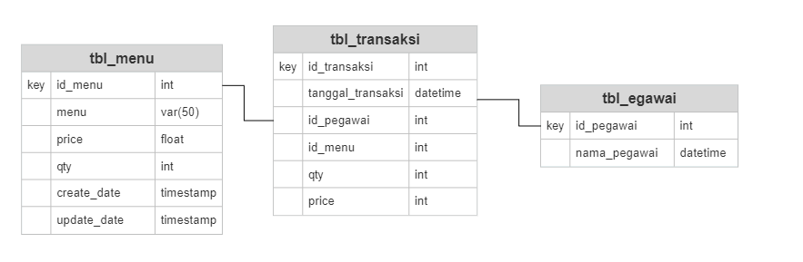

# RUMAH MAKAN

Untuk Menjawab soal no 1

Aplikasi ini diperuntukan untuk mencatat semua jenis transaksi pemesanan makan di warung makan yang bertujuan untuk mempermudah pembukan hasil penjualan dan pencatatan stok yang lebih efisien

Database : db_rumah_makan
Tabel :
- tbl_menu

| Fields | type |primary|
| ------ | ------ | ------ |
| id_menu | int auto_increment| primary key|
|menu |string(100)||
|harga | float/decimal||
|qty | int||
|create_date | datetime||
|update_date | datetime||

- tbl_penjualan

| Fields | type |primary|
| ------ | ------ | ------ |
|id_transaksi| int auto_increment|  primary key|
|tanggal_transaksi| datetime||
|id_pegawai| int ||
|no_meja| varchar(5) ||
|menu| varchar(100) ||
|qty| int ||
|price| float/decimal ||

- tbl_pegawai

| Fields | type |primary|
| ------ | ------ | ------ |
|id_pegawai | int auto_increment| primary key|
|nama_pegawai |varchar(50)||

## ERD

## Features

- Backedn = GO
karana untuk build dan hasil buildnya lebih cepat dan hasil build menjadi file exetension
- Router = GIN 
(Gin’s Performance
Baiknya performa gin sangat terpengaruh oleh route grouping dan small memory.

Kemampuan gin untuk route grouping memungkinkan route pada Gin nest tanpa batas dan tanpa mempengaruhi performa.

Sedangkan small memory membuat semakin sedikitnya memori yang dikonsumsi server yang menjadikannya lebih cepat. )

